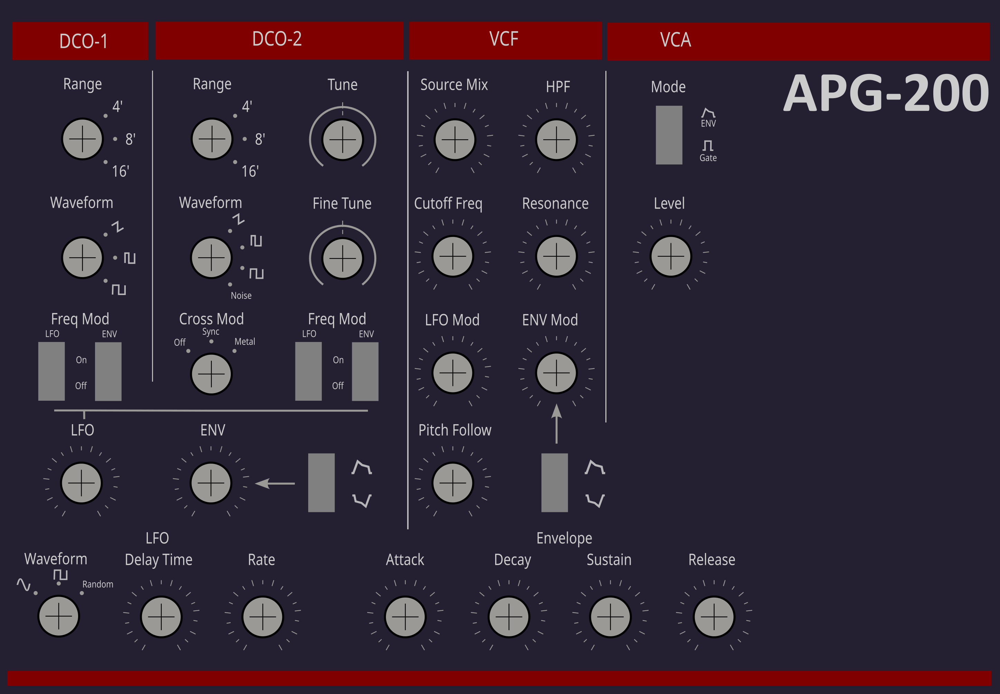

# APG-200 Panel Layout

This layout is based on the original controller layout and size with some minor differences. The layout of the rotary switch positions may need to be changed depending on the type of switches you have on hand. The Inkscape SVG file can be modified to suit your requirements (or to add more fancy colours)

Created in [Inkscape](https://inkscape.org/) with the free [Synth Panels Designer](https://synthpanels.design/) plugin. I got it directly from [this repo](https://gitlab.com/Faselunare/synth-panels-designer).

[Roland PG-200 Owner's Manual](https://cdn.roland.com/assets/media/pdf/PG-200_OM.pdf)

This work is openly licensed via [CC BY 4.0](https://creativecommons.org/licenses/by/4.0/)